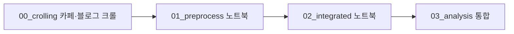

# 의대증원 중간 프로젝트 — 구조·데이터·분석 흐름

**목적:** 2024년 의대 증원 발표 이후 네이버 **블로그·카페** 텍스트를 모아, **구간(section 1~4)**별로 담론이 어떻게 바뀌는지 토큰·TF-IDF·시각화로 추적합니다.  
**이 문서만** 읽고도 저장소가 어떤 순서로 돌아가는지, 데이터·산출물이 어디에 생기는지 파악할 수 있도록 정리했습니다. 방법론·가설은 [ANALYSIS_PLAN.md](ANALYSIS_PLAN.md)를 참고하세요.

---

## 한눈에 보는 파이프라인



| 단계 | 하는 일 | 주요 산출 |
|------|---------|-----------|
| 0a | 네이버 **카페** 크롤 (Playwright) | `data/cafe_only/의대증원_카페_v2.json` |
| 0b | 네이버 **블로그** 크롤 (Selenium, 선택) | `data/blog_only/naver_blog_medical_quota.csv` 등 |
| 1 | 카페 JSON → 표 → Kiwi 명사 | `data/cafe_only/*.csv`, `*.pkl` |
| 2 | 블로그 반영 통합 CSV → 분석용 PKL | `data/integrated/crolling_total_estate_press.pkl` |
| 3 | 불용어·워드클라우드·TF-IDF·KMeans·LDA·구간 분포 | `outputs/pipeline/*`, `data/integrated/*_layered.pkl` |

---

## 디렉터리 구조 (요약)

```
의대증원_중간프로젝트/
├── PROJECT_STRUCTURE.md          # 본 문서 (진입점)
├── ANALYSIS_PLAN.md              # 분석 설계·방법론
├── README.md                     # 한 줄 소개 + 본 문서 링크
├── project_paths.py              # 모든 경로 상수 (노트북·스크립트 공통)
├── requirements_pipeline.txt
├── notebooks/
│   ├── lib/                      # notebook_bootstrap, stopword_utils, append_sticky (노트북 공통)
│   ├── 00_crolling/              # 크롤 전용 (카페·블로그 스크립트)
│   ├── 01_preprocess/          # 카페·블로그 전처리·형태소(카페 PKL 등)
│   ├── 02_integrated/            # 블로그 반영 후 통합 PKL 생성
│   ├── 03_analysis/              # 메인: 불용어·워드클라우드·TF-IDF·모델·layered PKL
├── config/stopwords/
├── data/
│   ├── cafe_only/README.md
│   ├── integrated/README.md
│   └── blog_only/README.md
└── outputs/pipeline/               # 하위 README 참고
```

---

## 노트북·스크립트 역할

| 경로 | 역할 |
|------|------|
| [notebooks/00_crolling/cafe_crolling.py](notebooks/00_crolling/cafe_crolling.py) | 네이버 **카페** 크롤 → `data/cafe_only/의대증원_카페_v2.json` (루트는 `project_paths.py` 기준 자동 탐지) |
| [notebooks/00_crolling/blog_crolling.py](notebooks/00_crolling/blog_crolling.py) | 네이버 **블로그** 크롤 → 기본 `data/blog_only/*.csv` (`--output`으로 변경 가능) |
| [notebooks/01_preprocess/cafe_preprocess_pipeline.ipynb](notebooks/01_preprocess/cafe_preprocess_pipeline.ipynb) | **카페 통합**: JSON → 전처리 CSV → Kiwi 명사·불용어 → 카페 PKL |
| [notebooks/01_preprocess/blog_flat_preprocess.ipynb](notebooks/01_preprocess/blog_flat_preprocess.ipynb) | `data/integrated/` 안에서 사용 가능한 통합 CSV 또는 PKL을 자동 선택해 **flat 입력** 전처리(TF-IDF 이전) |
| [notebooks/02_integrated/integrated_pipeline.ipynb](notebooks/02_integrated/integrated_pipeline.ipynb) | **통합 전처리**: 블로그 컬럼 정합 → 카페+블로그 병합·형태소 → 통합 PKL |
| [notebooks/02_integrated/culumn_name_same.py](notebooks/02_integrated/culumn_name_same.py) | 블로그 CSV 컬럼 정규화 스크립트 |
| [notebooks/03_analysis/section_analysis_pipeline.ipynb](notebooks/03_analysis/section_analysis_pipeline.ipynb) | **메인 통합 분석**: 불용어·워드클라우드·TF-IDF·KMeans·LDA·반응 지표·경량 감성 지표 |

**실행 방법:** Jupyter 작업 디렉터리가 프로젝트 루트이든 `notebooks/…` 하위든 상관없습니다. 각 노트북 첫 설정 셀에서 `notebook_bootstrap.setup_paths()`로 루트를 찾습니다.

---

## 데이터 폴더 산출물 (JSON · CSV · PKL)

| 위치 | 형식 | 파일(예) | 의미 | 생성 | 주로 읽는 쪽 |
|------|------|-----------|------|------|----------------|
| `data/cafe_only/` | JSON | `의대증원_카페_v2.json` | 카페 크롤 원본 | `00_crolling/cafe_crolling.py` | `01_preprocess/cafe_preprocess_pipeline.ipynb` |
| `data/cafe_only/` | CSV | `의대증원_cafedata_preprocess.csv` | 카페 전처리 표 | `cafe_preprocess_pipeline.ipynb` (1부) | 동일 노트북 (2부) |
| `data/cafe_only/` | PKL | `의대증원_cafedata_total_estate_press*.pkl` | 카페 단독 명사·불용어 처리 | `cafe_preprocess_pipeline.ipynb` | 통합 워크플로 시 `integrated`로 이관 |
| `data/blog_only/` | CSV | `naver_blog_medical_quota.csv` | 블로그 본문·댓글 수집 결과 | `00_crolling/blog_crolling.py` | 협업 파이프라인에서 통합 CSV와 병합 |
| `data/blog_only/` | CSV | `naver_blog_medical_quota_links.csv` | 링크 체크포인트 | `blog_crolling.py` | 재실행 시 이어 받기 |
| `data/integrated/` | CSV | `combined_section_sorted.csv` | 블로그+카페 통합 표 | 협업 제공 + `integrated_pipeline.ipynb` 보정 | `integrated_pipeline.ipynb` |
| `data/integrated/` | PKL | `crolling_total_estate_press.pkl` | 통합 분석용 메인 PKL | `integrated_pipeline.ipynb` | `03_analysis/section_analysis_pipeline.ipynb` |
| `data/integrated/` | PKL | `crolling_total_estate_press_layered.pkl` | 불용어 레이어 적용 후 | `section_analysis_pipeline.ipynb` | 보고·추가 모델링 |
| `data/integrated/` | CSV/PKL | `combined_section_sorted.csv` 또는 `combined_section_sorted_flat_comments.pkl` | flat 전처리용 입력 후보 | 통합 전처리 또는 제공 파일 | `01_preprocess/blog_flat_preprocess.ipynb` |

폴더별 요약: [data/cafe_only/README.md](data/cafe_only/README.md), [data/integrated/README.md](data/integrated/README.md), [data/blog_only/README.md](data/blog_only/README.md).

---

## `outputs/pipeline/` 산출물 (CSV · PNG 등)

### 루트 (`outputs/pipeline/`)

가능하면 **비워 두고**, 산출물은 아래 하위 폴더에 저장합니다.

### 하위 폴더

| 경로 | 용도 | 주로 연결되는 노트북 |
|------|------|----------------------|
| `tfidf/` | TF-IDF wide CSV, 고착어·고유어 후보 CSV, 히트맵 PNG 등 | `03_analysis/section_analysis_pipeline.ipynb` |
| `wordcloud/` | 구간별 워드클라우드 PNG와 원본·불용어 처리 후 비교 이미지 | 동일 |
| `kmeans/` | 군집 할당·엘보·구간 분포 CSV | `section_analysis_pipeline.ipynb` Step 6 |
| `lda/` | 토픽 키워드·문서 토픽 분포 등 | 동일 |
| `wordcloud/raw/`, `wordcloud/filtered/` | 불용어 전·후 구간별 워드클라우드와 상위 단어표 | `section_analysis_pipeline.ipynb` |
| `datasets/` | 토큰 확장 중간 테이블(용량 큼, .gitignore 대상일 수 있음) | (선택) 로컬 실험 시 수동 생성 |

상세: [outputs/pipeline/README.md](outputs/pipeline/README.md).

---

## 통합 노트북 `section_analysis_pipeline.ipynb`

| 항목 | 현재 메인 (`03_analysis/section_analysis_pipeline.ipynb`) |
|------|-----------------------------------------------------------|
| 입력 PKL | `data/integrated/crolling_total_estate_press.pkl` |
| 코드 구조 | [notebooks/lib/stopword_utils.py](notebooks/lib/stopword_utils.py) + Step 0~8 (전처리, TF-IDF, KMeans/LDA, 반응 지표, 감성 참고 지표) |
| 불용어 | `config/stopwords/` + `stopword_utils` 단일 경로 |
| TF-IDF | 전 코퍼스 한 번 `fit` 후 섹션별 평균 TF-IDF wide |
| 산출 | `outputs/pipeline/tfidf/`, `wordcloud/`, `kmeans/`, `lda/`, `sentiment/`, `data/integrated/*_layered.pkl` |

**flat 입력:** [`01_preprocess/blog_flat_preprocess.ipynb`](notebooks/01_preprocess/blog_flat_preprocess.ipynb)는 `combined_section_sorted_flat_comments.pkl`이 있으면 우선 사용하고, 없으면 `combined_section_sorted.csv`를 읽어 전처리를 진행합니다. 메인 PKL(`crolling_total_estate_press.pkl`)과 **수치·정의가 다를 수 있습니다.**

---

## `project_paths.py`와 `notebooks/lib/` 모듈

| 파일 | 역할 |
|------|------|
| [project_paths.py](project_paths.py) | `DATA_*`, `CONFIG_STOPWORDS`, `OUTPUTS_PIPELINE*`, `ensure_output_dirs()` |
| [notebooks/lib/notebook_bootstrap.py](notebooks/lib/notebook_bootstrap.py) | 노트북 첫 셀에서 루트·`notebooks/lib`를 `sys.path`에 추가 |
| [notebooks/lib/stopword_utils.py](notebooks/lib/stopword_utils.py) | 불용어 필터, TF-IDF 행렬, 섹션별 고착어 후보 등 **로직만** (파일 저장은 노트북이 담당) |
| [notebooks/lib/append_sticky_local_stopwords.py](notebooks/lib/append_sticky_local_stopwords.py) | 고착어 CSV → 섹션 로컬 불용어 txt (CLI) |

---

## 실행 시 유의

- 패키지: `pip install -r requirements_pipeline.txt`
- 크롤러: 카페는 Playwright, 블로그는 Selenium/Chrome 등 별도 환경이 필요할 수 있습니다.
- 대용량 `*.pkl`, `data/` 일부는 [.gitignore](.gitignore)로 제외될 수 있음 — 수업/재현 시 로컬에서 노트북을 순서대로 실행해 생성합니다.
