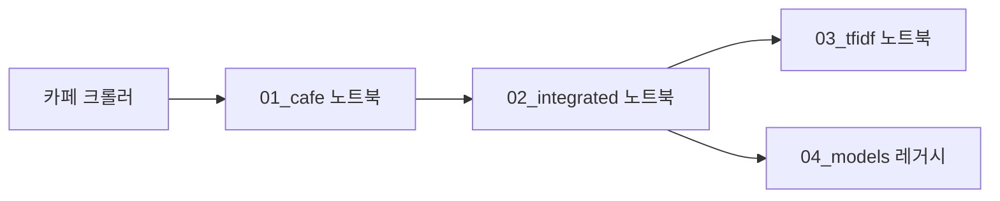

# 의대증원 중간 프로젝트 — 구조·데이터·분석 흐름 (교수님용 요약)

**목적:** 2024년 의대 증원 발표 이후 네이버 **블로그·카페** 텍스트를 모아, **구간(section 1~4)**별로 담론이 어떻게 바뀌는지 토큰·TF-IDF·시각화로 추적합니다.  
**이 문서만** 읽고도 저장소가 어떤 순서로 돌아가는지, 데이터·산출물이 어디에 생기는지 파악할 수 있도록 정리했습니다. 방법론·가설은 [ANALYSIS_PLAN.md](ANALYSIS_PLAN.md)를 참고하세요.

---

## 한눈에 보는 파이프라인



| 단계 | 하는 일 | 주요 산출 |
|------|-----------|-----------|
| 0 | 네이버 카페 크롤 | `data/cafe_only/의대증원_카페_v2.json` |
| 1 | 카페 JSON → 표 → Kiwi 명사 | `data/cafe_only/*.csv`, `*.pkl` |
| 2 | 블로그 반영 통합 CSV → 분석용 PKL | `data/integrated/crolling_total_estate_press.pkl` |
| 3 | 공통·로컬 불용어, TF-IDF, 워드클라우드 | `outputs/pipeline/*`, `data/integrated/*_layered.pkl` |
| (선택) | KMeans/LDA 등 **별도 입력** 실험 | `notebooks/04_models_legacy/*` |

---

## 디렉터리 구조 (요약)

```
의대증원_중간프로젝트/
├── PROJECT_STRUCTURE.md          # 본 문서 (진입점)
├── ANALYSIS_PLAN.md              # 분석 설계·방법론
├── README.md                     # 한 줄 소개 + 본 문서 링크
├── project_paths.py              # 모든 경로 상수 (노트북·스크립트 공통)
├── requirements_pipeline.txt
├── code/
│   ├── notebook_bootstrap.py     # 노트북에서 프로젝트 루트·code 경로 자동 설정
│   ├── stopword_utils.py         # 불용어·TF-IDF·고착어 유틸
│   ├── append_sticky_local_stopwords.py  # 고착어 CSV → 섹션 로컬 불용어 txt
│   └── 의대증원_카페크롤링_v2.py
├── notebooks/
│   ├── 01_cafe/                  # 통합 전 — 카페만
│   ├── 02_integrated/            # 블로그 반영 후 통합 PKL 생성
│   ├── 03_tfidf_stopwords/       # 메인: 불용어·TF-IDF·시각화·layered PKL
│   └── 04_models_legacy/         # 실험·레거시 (입력 PKL이 다를 수 있음)
├── config/stopwords/
├── data/
│   ├── cafe_only/README.md
│   ├── integrated/README.md
│   └── blog_only/README.md
└── outputs/pipeline/               # 하위 README 참고
```

---

## 노트북 역할 (폴더별)

| 경로 | 역할 |
|------|------|
| [notebooks/01_cafe/cafedata_preprocess.ipynb](notebooks/01_cafe/cafedata_preprocess.ipynb) | 카페 JSON → 전처리 CSV (`data/cafe_only/`) |
| [notebooks/01_cafe/cafedata_total_estate_press.ipynb](notebooks/01_cafe/cafedata_total_estate_press.ipynb) | 전처리 CSV → Kiwi 명사·1차 불용어 → 카페 단독 PKL |
| [notebooks/02_integrated/make_stopwords.ipynb](notebooks/02_integrated/make_stopwords.ipynb) | 통합 `combined_section_sorted.csv` → `crolling_total_estate_press.pkl` |
| [notebooks/03_tfidf_stopwords/section_tfidf_stopwords_pipeline.ipynb](notebooks/03_tfidf_stopwords/section_tfidf_stopwords_pipeline.ipynb) | **메인 파이프라인**: 통합 PKL → raw/clean/final → TF-IDF·고착어·워드클라우드 → `*_layered.pkl` |
| [notebooks/04_models_legacy/preprocess_after_project.ipynb](notebooks/04_models_legacy/preprocess_after_project.ipynb) | 워드클라우드·구간 TF-IDF·KMeans·LDA 등 **긴 실험 노트** (`combined_section_sorted_flat_comments.pkl` 등 **다른 입력** 가능) |
| [notebooks/04_models_legacy/test.ipynb](notebooks/04_models_legacy/test.ipynb) | 전체 학습 KMeans/LDA 후 구간별 분포 시각화 (`outputs/pipeline/datasets/` 등) |

**실행 방법:** Jupyter 작업 디렉터리가 프로젝트 루트이든 `notebooks/…` 하위든 상관없습니다. 각 노트북 첫 설정 셀에서 `notebook_bootstrap.setup_paths()`로 루트를 찾습니다.

---

## 데이터 파일 (어디에 무엇이 있는지)

상세 표는 각 폴더의 README를 보세요.

- [data/cafe_only/README.md](data/cafe_only/README.md) — 통합 **전** 카페 전용
- [data/integrated/README.md](data/integrated/README.md) — 블로그 반영 **후** 통합
- [data/blog_only/README.md](data/blog_only/README.md) — 블로그 전용 (선택, 비어 있을 수 있음)

---

## 산출물 `outputs/pipeline/`

- **루트에 두는 파일(최근 파이프라인):** 예) `tfidf_section_mean_wide.csv`, `sticky_keyword_candidates*.csv`, `unique_keyword_candidates_section*.csv`, 워드클라우드·히트맵 PNG 등 — [section_tfidf_stopwords_pipeline.ipynb](notebooks/03_tfidf_stopwords/section_tfidf_stopwords_pipeline.ipynb)가 생성합니다.
- **하위 폴더:** [outputs/pipeline/README.md](outputs/pipeline/README.md) 참고 — `kmeans/`, `lda/`, `tfidf/`, `wordcloud/raw|filtered/`, `datasets/` 등은 주로 **모델·실험 노트북**(`04_models_legacy`, `test.ipynb`)과 연결됩니다.

---

## `section_tfidf_stopwords_pipeline.ipynb` vs `preprocess_after_project.ipynb`

| 항목 | `section_tfidf_*` (메인) | `preprocess_after_project` (레거시/실험) |
|------|---------------------------|------------------------------------------|
| 입력 PKL | `data/integrated/crolling_total_estate_press.pkl` | `combined_section_sorted_flat_comments.pkl` 등 **별도 파일** 가능 |
| 코드 구조 | [stopword_utils.py](code/stopword_utils.py) 모듈 + 단계(Step 0~5) | 인라인 함수·한 파일에 시각화+KMeans+LDA |
| 불용어 | 공통 → 섹션 로컬, `nouns_final` | 노트북 내 불용어 로딩 로직 |
| TF-IDF | 전 코퍼스 한 어휘 공간에서 섹션별 평균 | 구간별로 별도 벡터화하는 셀 포함 |
| 산출 | 루트 CSV/PNG + `*_layered.pkl` | 주로 `outputs/pipeline/` 하위 + 기존 워드클라우드 경로 |

**향후:** 단일 “결과물 노트북”으로 합칠 때는 **입력 PKL을 하나로 통일**한 뒤, 모델 단계만 `section_*` 뒤로 옮기거나 공통 모듈로 빼는 것이 안전합니다.

---

## `project_paths.py`와 `stopword_utils.py`의 역할

| 파일 | 역할 |
|------|------|
| [project_paths.py](project_paths.py) | `DATA_*`, `CONFIG_STOPWORDS`, `OUTPUTS_PIPELINE*`, `ensure_output_dirs()` |
| [stopword_utils.py](code/stopword_utils.py) | 불용어 필터, TF-IDF 행렬, 섹션별 고착어 후보 등 **로직만** (파일 저장은 노트북이 담당) |

---

## 실행 시 유의

- 패키지: `pip install -r requirements_pipeline.txt`
- 크롤러: Playwright 등 별도 환경 필요할 수 있음.
- 대용량 `*.pkl`, `data/` 일부는 [.gitignore](.gitignore)로 제외될 수 있음 — 수업/재현 시 로컬에서 노트북을 순서대로 실행해 생성합니다.
