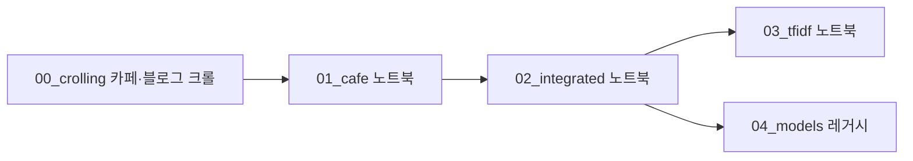

# 의대증원 중간 프로젝트 — 구조·데이터·분석 흐름

**목적:** 2024년 의대 증원 발표 이후 네이버 **블로그·카페** 텍스트를 모아, **구간(section 1~4)**별로 담론이 어떻게 바뀌는지 토큰·TF-IDF·시각화로 추적합니다.  
**이 문서만** 읽고도 저장소가 어떤 순서로 돌아가는지, 데이터·산출물이 어디에 생기는지 파악할 수 있도록 정리했습니다. 방법론·가설은 [ANALYSIS_PLAN.md](ANALYSIS_PLAN.md)를 참고하세요.

---

## 한눈에 보는 파이프라인



| 단계 | 하는 일 | 주요 산출 |
|------|---------|-----------|
| 0a | 네이버 **카페** 크롤 (Playwright) | `data/cafe_only/의대증원_카페_v2.json` |
| 0b | 네이버 **블로그** 크롤 (Selenium, 선택) | `data/blog_only/naver_blog_medical_quota.csv` 등 |
| 1 | 카페 JSON → 표 → Kiwi 명사 | `data/cafe_only/*.csv`, `*.pkl` |
| 2 | 블로그 반영 통합 CSV → 분석용 PKL | `data/integrated/crolling_total_estate_press.pkl` |
| 3 | 공통·로컬 불용어, TF-IDF, 워드클라우드 | `outputs/pipeline/*`, `data/integrated/*_layered.pkl` |
| (선택) | KMeans/LDA 등 **별도 입력** 실험 | `notebooks/04_models_legacy/` |

---

## 디렉터리 구조 (요약)

```
의대증원_중간프로젝트/
├── PROJECT_STRUCTURE.md          # 본 문서 (진입점)
├── ANALYSIS_PLAN.md              # 분석 설계·방법론
├── README.md                     # 한 줄 소개 + 본 문서 링크
├── project_paths.py              # 모든 경로 상수 (노트북·스크립트 공통)
├── requirements_pipeline.txt
├── code/
│   ├── notebook_bootstrap.py     # 노트북에서 프로젝트 루트·code 경로 자동 설정
│   ├── stopword_utils.py         # 불용어·TF-IDF·고착어 유틸
│   └── append_sticky_local_stopwords.py  # 고착어 CSV → 섹션 로컬 불용어 txt
├── notebooks/
│   ├── 00_crolling/              # 크롤 전용 (카페·블로그 스크립트)
│   ├── 01_cafe/                  # 통합 전 — 카페 전처리·형태소
│   ├── 02_integrated/            # 블로그 반영 후 통합 PKL 생성
│   ├── 03_tfidf_stopwords/       # 메인: 불용어·TF-IDF·시각화·layered PKL
│   └── 04_models_legacy/         # 실험·레거시 (입력 PKL이 다를 수 있음)
├── config/stopwords/
├── data/
│   ├── cafe_only/README.md
│   ├── integrated/README.md
│   └── blog_only/README.md
└── outputs/pipeline/               # 하위 README 참고
```

---

## 노트북·스크립트 역할

| 경로 | 역할 |
|------|------|
| [notebooks/00_crolling/cafe_crolling.py](notebooks/00_crolling/cafe_crolling.py) | 네이버 **카페** 크롤 → `data/cafe_only/의대증원_카페_v2.json` (루트는 `project_paths.py` 기준 자동 탐지) |
| [notebooks/00_crolling/naver_crawler.py](notebooks/00_crolling/naver_crawler.py) | 네이버 **블로그** 크롤 → 기본 `data/blog_only/*.csv` (`--output`으로 변경 가능) |
| [notebooks/01_cafe/cafedata_preprocess.ipynb](notebooks/01_cafe/cafedata_preprocess.ipynb) | 카페 JSON → 전처리 CSV (`data/cafe_only/`) |
| [notebooks/01_cafe/cafedata_total_estate_press.ipynb](notebooks/01_cafe/cafedata_total_estate_press.ipynb) | 전처리 CSV → Kiwi 명사·1차 불용어 → 카페 단독 PKL |
| [notebooks/02_integrated/make_stopwords.ipynb](notebooks/02_integrated/make_stopwords.ipynb) | 통합 `combined_section_sorted.csv` → `crolling_total_estate_press.pkl` |
| [notebooks/03_tfidf_stopwords/section_tfidf_stopwords_pipeline.ipynb](notebooks/03_tfidf_stopwords/section_tfidf_stopwords_pipeline.ipynb) | **메인 파이프라인**: 통합 PKL → raw/clean/final → TF-IDF·고착어·워드클라우드 → `*_layered.pkl` |
| [notebooks/04_models_legacy/preprocess_after_project.ipynb](notebooks/04_models_legacy/preprocess_after_project.ipynb) | 워드클라우드·구간 TF-IDF·KMeans·LDA 등 **긴 실험 노트** (`combined_section_sorted_flat_comments.pkl` 등 **다른 입력** 가능) |
| [notebooks/04_models_legacy/test.ipynb](notebooks/04_models_legacy/test.ipynb) | 전체 학습 KMeans/LDA 후 구간별 분포 시각화 (`outputs/pipeline/datasets/` 등) |

**실행 방법:** Jupyter 작업 디렉터리가 프로젝트 루트이든 `notebooks/…` 하위든 상관없습니다. 각 노트북 첫 설정 셀에서 `notebook_bootstrap.setup_paths()`로 루트를 찾습니다.

---

## 데이터 폴더 산출물 (JSON · CSV · PKL)

| 위치 | 형식 | 파일(예) | 의미 | 생성 | 주로 읽는 쪽 |
|------|------|-----------|------|------|----------------|
| `data/cafe_only/` | JSON | `의대증원_카페_v2.json` | 카페 크롤 원본 | `00_crolling/cafe_crolling.py` | `01_cafe/cafedata_preprocess.ipynb` |
| `data/cafe_only/` | CSV | `의대증원_cafedata_preprocess.csv` | 카페 전처리 표 | `cafedata_preprocess.ipynb` | `cafedata_total_estate_press.ipynb` |
| `data/cafe_only/` | PKL | `의대증원_cafedata_total_estate_press*.pkl` | 카페 단독 명사·불용어 처리 | `cafedata_total_estate_press.ipynb` | 통합 워크플로 시 `integrated`로 이관 |
| `data/blog_only/` | CSV | `naver_blog_medical_quota.csv` | 블로그 본문·댓글 수집 결과 | `00_crolling/naver_crawler.py` | 협업 파이프라인에서 통합 CSV와 병합 |
| `data/blog_only/` | CSV | `naver_blog_medical_quota_links.csv` | 링크 체크포인트 | `naver_crawler.py` | 재실행 시 이어 받기 |
| `data/integrated/` | CSV | `combined_section_sorted.csv` | 블로그+카페 통합 표 | 협업 제공 + `make_stopwords.ipynb` 보정 | `make_stopwords.ipynb` |
| `data/integrated/` | PKL | `crolling_total_estate_press.pkl` | 통합 분석용 메인 PKL | `make_stopwords.ipynb` | `section_tfidf_stopwords_pipeline.ipynb` |
| `data/integrated/` | PKL | `crolling_total_estate_press_layered.pkl` | 불용어 레이어 적용 후 | `section_tfidf_stopwords_pipeline.ipynb` | 보고·추가 모델링 |
| `data/integrated/` | PKL | `combined_section_sorted_flat_comments.pkl` | (있을 경우) 레거시 실험 입력 | 과거 전처리 | `preprocess_after_project.ipynb` |

폴더별 요약: [data/cafe_only/README.md](data/cafe_only/README.md), [data/integrated/README.md](data/integrated/README.md), [data/blog_only/README.md](data/blog_only/README.md).

---

## `outputs/pipeline/` 산출물 (CSV · PNG 등)

### 루트 (`outputs/pipeline/`)

| 형식 | 파일(예) | 의미 | 생성 |
|------|-----------|------|------|
| CSV | `tfidf_section_mean_wide.csv` | 섹션별 평균 TF-IDF wide | `section_tfidf_stopwords_pipeline.ipynb` |
| CSV | `sticky_keyword_candidates.csv`, `sticky_keyword_candidates_section*.csv` | 통합·섹션별 고착어 후보 | 동일 |
| CSV | `unique_keyword_candidates_section*.csv` | 섹션 고유 키워드 후보 | 동일 |
| CSV | `section_top_word_frequency.csv` | 섹션별 빈도 | 동일 |
| PNG | `wordcloud_by_section.png`, `wordcloud_bf_stopwords.png`, `tfidf_heatmap_union_top.png` 등 | 시각화 | 동일 |

### 하위 폴더

| 경로 | 용도 | 주로 연결되는 노트북 |
|------|------|----------------------|
| `kmeans/` | 군집 할당·엘보·구간 분포 CSV | `04_models_legacy`, `test.ipynb` |
| `lda/` | 토픽 키워드·문서 토픽 분포·html 등 | 동일 |
| `tfidf/` | TF-IDF 요약 표·히트맵 | 전처리 실험·메인과 중복 가능 — 파일별 확인 |
| `wordcloud/raw/`, `wordcloud/filtered/` | 구간별 워드클라우드·top100 CSV | `preprocess_after_project.ipynb` 등 |
| `datasets/` | 토큰 확장 중간 테이블(용량 큼, .gitignore 대상일 수 있음) | `test.ipynb` |

상세: [outputs/pipeline/README.md](outputs/pipeline/README.md).

---

## `section_tfidf_stopwords_pipeline.ipynb` vs `preprocess_after_project.ipynb`

| 항목 | `section_tfidf_*` (메인) | `preprocess_after_project` (레거시/실험) |
|------|---------------------------|------------------------------------------|
| 입력 PKL | `data/integrated/crolling_total_estate_press.pkl` | `combined_section_sorted_flat_comments.pkl` 등 **별도 파일** 가능 |
| 코드 구조 | [stopword_utils.py](code/stopword_utils.py) 모듈 + 단계(Step 0~5) | 인라인 함수·한 파일에 시각화+KMeans+LDA |
| 불용어 | 공통 → 섹션 로컬, `nouns_final` | 노트북 내 불용어 로딩 로직 |
| TF-IDF | 전 코퍼스 한 어휘 공간에서 섹션별 평균 | 구간별로 별도 벡터화하는 셀 포함 |
| 산출 | 루트 CSV/PNG + `*_layered.pkl` | 주로 `outputs/pipeline/` 하위 + 기존 워드클라우드 경로 |

### K-Means 이전: 불용어 · 워드클라우드 · TF-IDF만 놓고 본 차이

| 관점 | `preprocess_after_project` | `section_tfidf_stopwords_pipeline` |
|------|----------------------------|-------------------------------------|
| **입력** | `combined_section_sorted_flat_comments.pkl` — 댓글 평탄화 등 **이미 넓게 가공된** 가정 | `crolling_total_estate_press.pkl` — `title` / `document` / `comment` **명사 리스트** 컬럼 중심 |
| **명사·코퍼스** | 노트북에서 `full_nouns_filtered` 등으로 조합 (`INCLUDE_TITLE_NOUNS` 등) | `snapshot_noun_columns` → `*_raw`, `apply_global_clean` → `*_clean`, `row_merged_tokens` → `corpus_clean` |
| **불용어** | `load_stopwords` + `get_section_stopwords`로 구간마다 common+local **인라인 합집합** | `stopwords_common.txt` + `stopwords-ko.txt` → `apply_global_clean`; 이후 `stopwords_local_section{n}.txt` → `apply_local_clean` (`stopword_utils`) |
| **워드클라우드 시점** | **불용어 적용 전**, 구간별 4장 → `outputs/pipeline/wordcloud/raw/` | **Step 4**, 로컬 불용어까지 반영된 **`nouns_final`** 기준 → 루트 PNG 등 |
| **TF-IDF** | 구간별 문서만 모아 **구간마다 별도** `TfidfVectorizer` (`tokenizer=str.split`) | **전체 코퍼스**에 한 번 `fit` 후 섹션별 **평균 TF-IDF** wide + 고착어·고유어 CSV |
| **부가 산출** | raw 워드클라우드·해당 CSV 위주 | sticky / 섹션별 sticky, unique keyword, 히트맵, `*_layered.pkl` |

같은 말(불용어·워드클라우드·TF-IDF)이라도 **입력 스키마·적용 순서·수학적 정의(구간별 재학습 vs 전역 한 번)**가 다릅니다. **수치·그림을 직접 비교해 해석하면 안 됩니다.**

**향후:** 단일 “결과물 노트북”으로 합칠 때는 **입력 PKL을 하나로 통일**한 뒤, 모델 단계만 `section_`* 뒤로 옮기거나 공통 모듈로 빼는 것이 안전합니다.

---

## `project_paths.py`와 `stopword_utils.py`의 역할

| 파일 | 역할 |
|------|------|
| [project_paths.py](project_paths.py) | `DATA_*`, `CONFIG_STOPWORDS`, `OUTPUTS_PIPELINE*`, `ensure_output_dirs()` |
| [stopword_utils.py](code/stopword_utils.py) | 불용어 필터, TF-IDF 행렬, 섹션별 고착어 후보 등 **로직만** (파일 저장은 노트북이 담당) |

---

## 실행 시 유의

- 패키지: `pip install -r requirements_pipeline.txt`
- 크롤러: 카페는 Playwright, 블로그는 Selenium/Chrome 등 별도 환경이 필요할 수 있습니다.
- 대용량 `*.pkl`, `data/` 일부는 [.gitignore](.gitignore)로 제외될 수 있음 — 수업/재현 시 로컬에서 노트북을 순서대로 실행해 생성합니다.
